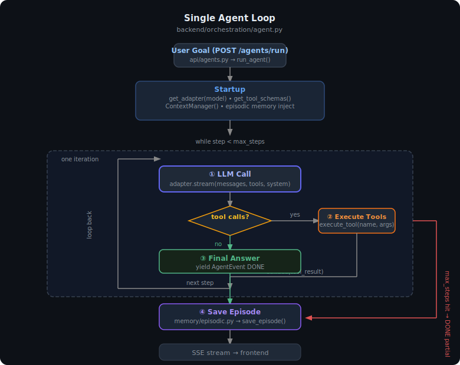
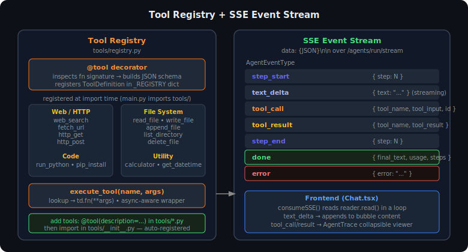
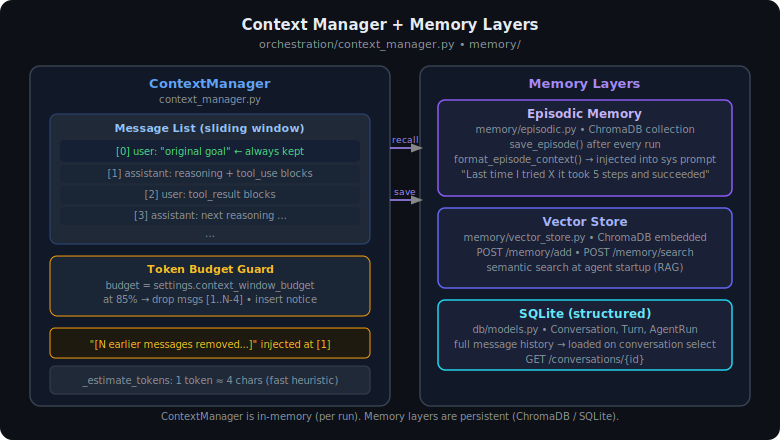
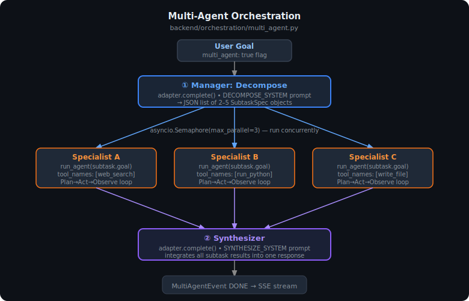

# Architecture

This document describes the full system design of the LLM Orchestration Platform — its layers, data flows, key abstractions, and the reasoning behind each design decision.

---

## Table of Contents

1. [System Overview](#1-system-overview)
2. [Layer Breakdown](#2-layer-breakdown)
3. [LLM Router & Adapter Layer](#3-llm-router--adapter-layer)
4. [The Agent Loop](#4-the-agent-loop)
5. [Tool Registry](#5-tool-registry)
6. [Memory Architecture](#6-memory-architecture)
7. [Multi-Agent Orchestration](#7-multi-agent-orchestration)
8. [API & Streaming Layer](#8-api--streaming-layer)
9. [Data Storage](#9-data-storage)
10. [Frontend Architecture](#10-frontend-architecture)
11. [Design Decisions](#11-design-decisions)
12. [Cloud Migration Path](#12-cloud-migration-path)

---

## 1. System Overview

```
┌─────────────────────────────────────────────────────────────────────┐
│                    LLM ORCHESTRATION PLATFORM                       │
│                                                                     │
│  ┌──────────────────────────────────────────────────────────────┐   │
│  │              FRONTEND  (React + Vite + TypeScript)           │   │
│  │  Chat UI · Sidebar · Agent Trace Viewer · Model Selector     │   │
│  └──────────────────────────────┬───────────────────────────────┘   │
│                                 │  REST + Server-Sent Events (SSE)  │
│  ┌──────────────────────────────▼───────────────────────────────┐   │
│  │              FASTAPI BACKEND  (Python 3.13)                  │   │
│  │  /chat/stream · /agents/run/stream · /conversations          │   │
│  └──────────────────────────────┬───────────────────────────────┘   │
│                                 │                                   │
│  ┌──────────────────────────────▼───────────────────────────────┐   │
│  │              ORCHESTRATION ENGINE                            │   │
│  │  Single Agent Loop · Multi-Agent Manager · Context Manager   │   │
│  └──────────┬──────────────────────────────┬────────────────────┘   │
│             │                              │                        │
│  ┌──────────▼──────────┐      ┌────────────▼──────────────────┐    │
│  │   LLM ROUTER        │      │   TOOL REGISTRY               │    │
│  │                     │      │                               │    │
│  │  Anthropic          │      │  web_search   run_python      │    │
│  │  OpenAI             │      │  fetch_url    pip_install      │    │
│  │  Gemini             │      │  read_file    http_get         │    │
│  │  Ollama (local)     │      │  write_file   http_post        │    │
│  │  OpenRouter (300+)  │      │  calculator   get_datetime     │    │
│  └─────────────────────┘      └───────────────────────────────┘    │
│                                                                     │
│  ┌──────────────────────────────────────────────────────────────┐   │
│  │              MEMORY SYSTEM                                   │   │
│  │  In-Context (ContextManager) · ChromaDB (vector + episodic)  │   │
│  └──────────────────────────────────────────────────────────────┘   │
│                                                                     │
│  ┌──────────────────────────────────────────────────────────────┐   │
│  │              STORAGE                                         │   │
│  │  SQLite (conversations, turns, agent runs)                   │   │
│  │  ChromaDB embedded (vector documents, episodic summaries)    │   │
│  │  Local filesystem (code artifacts, generated files)          │   │
│  └──────────────────────────────────────────────────────────────┘   │
└─────────────────────────────────────────────────────────────────────┘
```

---

## 2. Layer Breakdown

Each layer has a single responsibility and a clean interface to the layer below it.

| Layer | Files | Responsibility |
|---|---|---|
| **Frontend** | `frontend/src/` | Render UI, consume SSE, manage local state |
| **API** | `backend/api/` | HTTP routing, request validation, SSE framing |
| **Orchestration** | `backend/orchestration/` | Agent loop, multi-agent coordination, context management |
| **LLM Router** | `backend/adapters/` | Normalize all LLM providers to a single interface |
| **Tool Registry** | `backend/tools/` | Register, describe, and execute tools |
| **Memory** | `backend/memory/` | Semantic storage and retrieval (ChromaDB) |
| **DB** | `backend/db/` | Structured persistence (SQLite via SQLModel) |

---

## 3. LLM Router & Adapter Layer

The core design principle: **every model looks the same to the orchestration layer**.

```
get_adapter("claude-sonnet-4-6")     →  AnthropicAdapter
get_adapter("gpt-4o")                →  OpenAIAdapter
get_adapter("gemini-2.5-flash")      →  GeminiAdapter
get_adapter("llama3.2")              →  OllamaAdapter   (local, no API key)
get_adapter("anthropic/claude-opus") →  OpenRouterAdapter
get_adapter("my-custom-model")       →  OllamaAdapter   (fallback)
```

### BaseLLMAdapter interface

```python
class BaseLLMAdapter(ABC):

    async def stream(
        self,
        messages: list[Message],
        tools: list[dict] | None,
        system: str | None,
        max_tokens: int,
        temperature: float,
    ) -> AsyncIterator[StreamEvent]:
        """Yield StreamEvent objects: TEXT_DELTA, TOOL_CALL_*, USAGE, STOP"""

    async def complete(
        self,
        messages: list[Message],
        tools: list[dict] | None,
        system: str | None,
        max_tokens: int,
        temperature: float,
    ) -> CompletionResult:
        """Non-streaming. Returns full text + tool calls."""
```

### Provider implementations

```
┌──────────────────────────────────────────────────────────────────┐
│  BaseLLMAdapter                                                  │
│  stream() · complete() · embed() · format_tool_schema()          │
└──────┬────────────┬──────────────┬───────────────┬──────────────┘
       │            │              │               │
  AnthropicAdapter  │         GeminiAdapter   OllamaAdapter
  (native SDK,      │         (OpenAI-compat  (OpenAI-compat
   streaming API)   │          Google endpoint) Ollama /v1)
                    │
              OpenAIAdapter ◄── OpenRouterAdapter
              (openai SDK)       (openrouter.ai/api/v1)
```

**Why Gemini/Ollama/OpenRouter reuse the OpenAI adapter:**
All three expose an OpenAI-compatible `/v1/chat/completions` endpoint. One adapter implementation covers all of them — just swap the `base_url` and `api_key`. This is the fastest path to supporting new providers: if they have an OpenAI-compatible endpoint, zero new code is needed.

### Tool schema normalization

Each provider expects function/tool schemas in a slightly different format. The adapter layer handles this:

```
Normalized schema (internal):              Anthropic format:
{                                          {
  "name": "web_search",          →           "name": "web_search",
  "description": "...",                      "description": "...",
  "parameters": {                            "input_schema": {
    "type": "object",                          "type": "object",
    "properties": { ... },                     "properties": { ... }
    "required": [...]                        }
  }                                        }
}                                          OpenAI format:
                                           {
                                             "type": "function",
                                             "function": {
                                               "name": "web_search",
                                               "description": "...",
                                               "parameters": { ... }
                                             }
                                           }
```

---

## 4. The Agent Loop

The single-agent loop is the core product. It runs in `backend/orchestration/agent.py`.



```
                     ┌──────────────────────┐
                     │   RECEIVE GOAL       │
                     │  "Research EV market │
                     │   and write report"  │
                     └──────────┬───────────┘
                                │
                     ┌──────────▼───────────┐
                     │  LOAD EPISODIC       │
                     │  MEMORY              │
                     │  "Last time I tried  │
                     │   this, I found..."  │
                     └──────────┬───────────┘
                                │
                ┌───────────────▼───────────────┐
                │           PLAN                │◄────────────────────┐
                │  Chain-of-thought reasoning   │                     │
                │  about what steps are needed  │                     │
                └───────────────┬───────────────┘                     │
                                │                                     │
                ┌───────────────▼───────────────┐                     │
                │           ACT                 │                     │
                │  Emit tool_call(s)            │                     │
                │  web_search, run_python,      │                     │
                │  write_file, http_get, ...    │                     │
                └───────────────┬───────────────┘                     │
                                │                                     │
                ┌───────────────▼───────────────┐                     │
                │         OBSERVE               │                     │
                │  Execute tool(s) in parallel  │                     │
                │  Inject results into context  │                     │
                └───────────────┬───────────────┘                     │
                                │                                     │
                ┌───────────────▼───────────────┐    replan           │
                │         REFLECT               ├─────────────────────┘
                │  Did that work?               │
                │  Am I closer to the goal?     │
                │  What next?                   │
                └───────────────┬───────────────┘
                                │ goal achieved
                ┌───────────────▼───────────────┐
                │  SAVE EPISODE TO MEMORY       │
                │  Store run summary in         │
                │  ChromaDB for future recall   │
                └───────────────┬───────────────┘
                                │
                ┌───────────────▼───────────────┐
                │      FINAL RESPONSE           │
                └───────────────────────────────┘
```

### AgentEvent stream

The loop yields typed events that are forwarded to the frontend via SSE:

| Event | When emitted | Payload |
|---|---|---|
| `step_start` | Beginning of each loop iteration | `step` number |
| `text_delta` | Each token of model output | `text` fragment |
| `tool_call` | Model requests a tool | `tool_name`, `tool_input` |
| `tool_result` | Tool execution complete | `tool_name`, `tool_result` |
| `step_end` | End of loop iteration | `step` number |
| `done` | Goal achieved or max_steps hit | `final_text`, `usage`, `stop_reason` |
| `error` | Unrecoverable exception | `error` message |

### Context window management

```
┌────────────────────────────────────────────────────────┐
│  Context window (100K token budget)                    │
│                                                        │
│  [system prompt + episodic memory]                     │
│  [user goal]                                           │
│  [step 1: assistant reasoning + tool calls]            │
│  [step 1: tool results]                                │
│  [step 2: assistant reasoning + tool calls]            │
│  [step 2: tool results]                                │
│  ...                                                   │
│                                                        │
│  When > 85% full → compress: drop oldest turns,       │
│  insert "[N messages removed]" notice, keep goal      │
│  and recent tail intact                               │
└────────────────────────────────────────────────────────┘
```

---

## 5. Tool Registry



Tools are registered via a `@tool` decorator that:
1. Auto-generates a JSON Schema from the Python function signature
2. Registers the tool by name in a global dict
3. Wraps it in an async executor

```python
@tool(description="Search the web for current information.")
async def web_search(query: str, max_results: int = 5) -> str:
    ...
```

This produces:

```json
{
  "name": "web_search",
  "description": "Search the web for current information.",
  "parameters": {
    "type": "object",
    "properties": {
      "query":       { "type": "string" },
      "max_results": { "type": "integer" }
    },
    "required": ["query"]
  }
}
```

### Built-in tools

```
┌─────────────────────────────────────────────────────────────────┐
│  TOOL REGISTRY                                                  │
│                                                                 │
│  Web          web_search(query, max_results)                    │
│               fetch_url(url)                                    │
│                                                                 │
│  Code         run_python(code, timeout)   ← sandboxed subprocess│
│               pip_install(package)                              │
│                                                                 │
│  Files        read_file(path)             ← artifacts/ only     │
│               write_file(path, content)                         │
│               append_file(path, content)                        │
│               list_directory(path)                              │
│               delete_file(path)           ← requires_confirmation│
│                                                                 │
│  HTTP         http_get(url, headers)                            │
│               http_post(url, body, headers)                     │
│                                                                 │
│  Utility      calculator(expression)      ← safe math eval      │
│               get_datetime()                                    │
│               format_json(json_string)                          │
└─────────────────────────────────────────────────────────────────┘
```

**Security model for file tools:** All file operations are path-sandboxed to `./data/artifacts/`. Any path that resolves outside this directory raises `PermissionError` before execution. This prevents the agent from reading or modifying system files.

**Security model for code execution:** Python runs in a subprocess with a configurable timeout (default 30s). The subprocess is killed on timeout. No network isolation is applied (the agent can make HTTP calls from within Python — this is intentional for agentic use cases).

---

## 6. Memory Architecture



Four memory types, matching the taxonomy from AI systems research:

```
┌──────────────────┐  ┌──────────────────┐  ┌──────────────────┐
│  IN-CONTEXT      │  │  EXTERNAL        │  │  IN-WEIGHTS      │
│  (Working)       │  │  (Long-Term)     │  │  (Baked-In)      │
│                  │  │                  │  │                  │
│  ContextManager  │  │  ChromaDB        │  │  Model weights   │
│  sliding window  │  │  vector store    │  │  (read-only,     │
│  token budget    │  │  semantic search │  │  cannot change   │
│                  │  │  RAG retrieval   │  │  at runtime)     │
│  Lost when       │  │  Persists across │  │                  │
│  session ends    │  │  sessions        │  │                  │
└──────────────────┘  └──────────────────┘  └──────────────────┘

┌────────────────────────────────────────────────────────────────┐
│  EPISODIC  (Run History)                                       │
│                                                                │
│  After each agent run: save goal + outcome + summary           │
│  Before each agent run: retrieve similar past episodes         │
│  "Last time I tried to scrape this site it blocked me —        │
│   use a different approach"                                    │
└────────────────────────────────────────────────────────────────┘
```

### Memory flow during an agent run

```
Agent starts
     │
     ▼
Retrieve relevant past episodes from ChromaDB
(semantic search: "find runs similar to this goal")
     │
     ▼
Inject episode context into system prompt
     │
     ▼
         ┌─── Agent Loop ──────────────────────────────────┐
         │                                                 │
         │  Important findings can be stored mid-run:      │
         │  memory.add("API X requires OAuth2, not key")   │
         │                                                 │
         └─────────────────────────────────────────────────┘
     │
     ▼
Save episode summary: goal + outcome + steps_taken → ChromaDB
```

### Vector store collections

| Collection | Contents | Used by |
|---|---|---|
| `episodic_memory` | Completed agent run summaries | Agent startup retrieval |
| `knowledge_base` | User-stored documents and facts | `/memory/add` + `/memory/search` |

---

## 7. Multi-Agent Orchestration



For goals too large or complex for a single context window, a manager agent decomposes the work:

```
USER GOAL
"Research competitive landscape of EV market and write a 5-page report with charts"
     │
     ▼
┌─────────────────────────────────────────────┐
│  MANAGER AGENT                              │
│                                             │
│  Calls the LLM with:                        │
│  "Decompose this goal into 2-5 subtasks     │
│   that can be worked on independently.      │
│   Return JSON."                             │
│                                             │
│  Output:                                    │
│  [ {title: "Market research",               │
│     goal: "Find top 5 EV companies...",     │
│     tools: ["web_search"]},                 │
│    {title: "Financial analysis",            │
│     goal: "Get earnings for each...",       │
│     tools: ["web_search", "run_python"]},   │
│    {title: "Chart generation",              │
│     goal: "Create comparison charts...",    │
│     tools: ["run_python", "write_file"]} ]  │
└────────────┬────────────────────────────────┘
             │  spawn (up to 3 in parallel)
    ┌────────┼────────┬────────────────┐
    │        │        │                │
    ▼        ▼        ▼                │
┌───────┐ ┌───────┐ ┌────────┐        │
│AGENT 1│ │AGENT 2│ │AGENT 3 │        │
│Market │ │Finance│ │Charts  │        │
│research│ │analyst│ │maker   │        │
└───┬───┘ └───┬───┘ └───┬────┘        │
    │         │          │             │
    └─────────┴──────────┘             │
              │ results                │
              ▼                        │
┌─────────────────────────────────────▼──┐
│  SYNTHESIS AGENT                       │
│                                        │
│  Receives all subtask results          │
│  Integrates into final coherent output │
│  Returns to user                       │
└────────────────────────────────────────┘
```

**Inter-agent communication:** Each specialist agent is a fully independent run of the agent loop — its own context window, its own tool access. Results are plain text passed via the orchestrator. No shared memory between specialist agents during execution.

---

## 8. API & Streaming Layer

### SSE streaming architecture

```
Agent Loop (Python async generator)
     │ yields AgentEvent objects
     ▼
FastAPI StreamingResponse
     │ serializes to "data: {...}\n\n"
     ▼
HTTP response with Content-Type: text/event-stream
     │
     ▼
React frontend (consumeSSE)
     │ reads reader.read() chunks
     │ splits on "\n", strips "data: "
     │ parses JSON
     ▼
setMessages() → React re-render → streaming UI update
```

### Event flow for a single agent step

```
Backend                                     Frontend
──────                                      ────────
yield step_start(step=3)           →        show "Step 3..." indicator
yield text_delta(text="I'll")      →        append to message bubble
yield text_delta(text=" search")   →        append to message bubble
yield tool_call(web_search, {...}) →        show tool chip in trace panel
  [execute web_search]
yield tool_result("Tesla Q1...")   →        show result in trace panel
yield text_delta(text="Based on") →        append to message bubble
...
yield done(final_text, usage)      →        finalize bubble, show usage
```

### API route summary

```
POST /chat/stream              Stream chat response (no agent loop)
POST /chat                     Non-streaming chat

POST /agents/run/stream        Stream agent loop events
GET  /agents/tools             List all registered tools + schemas
GET  /agents/models            Known model IDs by provider
GET  /agents/runs              Past agent run history

GET  /conversations            List conversations
POST /conversations            Create conversation
GET  /conversations/{id}       Get conversation with all turns
PATCH /conversations/{id}      Rename / update
DELETE /conversations/{id}     Delete

POST /memory/add               Store document in ChromaDB
POST /memory/search            Semantic search
GET  /memory/episodes          Retrieve past agent run summaries
GET  /memory/stats             Document counts per collection

GET  /                         Health + version
GET  /health                   {"status": "ok"}
GET  /docs                     Interactive Swagger UI
```

---

## 9. Data Storage

### SQLite schema

```sql
-- Persists conversation metadata
CREATE TABLE conversation (
    id          TEXT PRIMARY KEY,
    title       TEXT,
    model       TEXT,
    system_prompt TEXT,
    created_at  DATETIME,
    updated_at  DATETIME,
    meta        JSON
);

-- Each message turn (user or assistant)
CREATE TABLE turn (
    id              TEXT PRIMARY KEY,
    conversation_id TEXT REFERENCES conversation(id),
    role            TEXT,           -- user | assistant
    content         TEXT,
    model           TEXT,
    step            INTEGER,        -- agent step index, if applicable
    tool_calls      JSON,
    tool_results    JSON,
    token_count     INTEGER,
    created_at      DATETIME,
    meta            JSON
);

-- Agent run records (one per goal)
CREATE TABLE agentrun (
    id              TEXT PRIMARY KEY,
    conversation_id TEXT REFERENCES conversation(id),
    goal            TEXT,
    model           TEXT,
    status          TEXT,           -- running | completed | failed | stopped
    steps_taken     INTEGER,
    total_tokens    INTEGER,
    result          TEXT,
    error           TEXT,
    started_at      DATETIME,
    finished_at     DATETIME,
    meta            JSON
);
```

### ChromaDB collections

```
chroma/
├── episodic_memory/        # agent run summaries, indexed by goal text
│   └── ...                 # metadata: goal, outcome, model, steps, timestamp
└── knowledge_base/         # user-stored documents
    └── ...                 # metadata: user-defined
```

### Filesystem artifacts

```
data/
├── db.sqlite               # SQLite database
├── chroma/                 # ChromaDB persistent storage
└── artifacts/              # Files created by agents (code output, reports, etc.)
    ├── exec_*.py           # Temp Python scripts (cleaned up after run)
    └── [agent-created files]
```

---

## 10. Frontend Architecture

```
App.tsx
├── useConversations()          # fetch/create/rename/delete via REST
├── Sidebar                     # conversation list + new conversation button
│   └── renders conversation[] from hook
└── Chat (active conversation)
    ├── useEffect → load turns on conversation change
    ├── ModelSelector            # dropdown + Chat/Agent toggle
    ├── message list → MessageBubble[]
    │   ├── user bubble (purple, right-aligned)
    │   └── assistant bubble
    │       ├── MarkdownContent  # inline markdown renderer (no external deps)
    │       └── AgentTrace       # collapsible tool call steps
    │           └── step N
    │               ├── tool_call: name + input JSON
    │               └── tool_result: output (scrollable, capped)
    └── textarea input
        ├── Enter → send()
        └── send() → POST /chat/stream or /agents/run/stream
                   → consumeSSE() → setMessages() updates
```

### State management

No Redux or Zustand — plain React `useState` + `useCallback`. Each component owns its local state. The `useConversations` hook is the only shared state (conversation list + CRUD operations).

### SSE consumer

```typescript
async function consumeSSE(response: Response, onLine: (data: string) => void) {
  const reader = response.body?.getReader()
  const decoder = new TextDecoder()
  let buffer = ''

  while (true) {
    const { done, value } = await reader.read()
    if (done) break
    buffer += decoder.decode(value, { stream: true })
    const lines = buffer.split('\n')
    buffer = lines.pop() ?? ''           // keep incomplete line in buffer
    for (const line of lines) {
      if (line.startsWith('data: ')) onLine(line.slice(6))
    }
  }
}
```

---

## 11. Design Decisions

### Why a single `BaseLLMAdapter` interface?

The orchestration engine should not know which model it's talking to. This decoupling means:
- Swapping models is one line of config
- Multi-agent runs can use different models for manager vs specialists
- Adding a new provider is ~50 lines of code with no changes upstream

### Why reuse the OpenAI adapter for Gemini/Ollama/OpenRouter?

All three expose OpenAI-compatible endpoints. The OpenAI SDK's streaming parser handles them all. This avoids maintaining separate streaming parsers (a significant source of bugs) for each provider. The tradeoff is dependency on OpenAI's SDK even for non-OpenAI models — acceptable given its stability.

### Why SSE over WebSockets?

SSE is unidirectional (server → client), which is exactly the pattern needed for streaming responses. It's simpler to implement (standard HTTP), works through proxies and load balancers without configuration, and requires no connection management. WebSockets would add bidirectional complexity for no gain here.

### Why SQLite + ChromaDB instead of a single database?

SQLite handles structured relational data (conversations, turns, metadata) extremely well and needs zero infrastructure. ChromaDB handles vector similarity search, which SQLite cannot do natively. The two are complementary, not competing. For cloud deployment, SQLite → Postgres and ChromaDB → Qdrant are one-file swaps.

### Why ChromaDB embedded instead of a hosted vector DB?

For a personal tool running locally, embedded ChromaDB requires zero infrastructure, zero latency to a remote service, and no data leaves the machine. The same `VectorStore` interface class makes swapping to Qdrant or Pinecone a backend-only change.

### Why the `@tool` decorator pattern?

It keeps tool definitions close to their implementations, auto-generates schemas from type annotations (no duplication), and makes adding new tools trivial. The alternative — a separate YAML/JSON tool registry — would require keeping schema and implementation in sync manually.

### Why no RAG for tool selection?

With 14 tools, the full list fits in every prompt without hitting token limits. Semantic tool retrieval only becomes necessary at ~100+ tools. The current approach (always inject all schemas) is simpler and more reliable — the model sees everything and decides.

---

## 12. Cloud Migration Path

The local-first stack is designed for a clean cloud migration:

```
Local Development                    Cloud Production
──────────────────                   ─────────────────
SQLite file          →               Postgres (change one URL in config.py)
ChromaDB embedded    →               Qdrant Cloud / self-hosted
Local filesystem     →               S3 / R2 (swap artifacts_path logic)
Single process       →               Docker Compose / Fly.io / Railway
Single user          →               Add auth (FastAPI + JWT or Clerk)
```

The `settings` object in `backend/config.py` is the only place that needs updating. All other code reads from `settings`.

```python
# config.py — the only file that changes for cloud
class Settings(BaseSettings):
    db_path: str = "./data/db.sqlite"           # → postgres://...
    chroma_path: str = "./data/chroma"          # → qdrant://...
    artifacts_path: str = "./data/artifacts"    # → s3://bucket/...
```

### Docker Compose (included)

```yaml
services:
  backend:
    build: .
    ports: ["8000:8000"]
    volumes: ["./data:/app/data"]
    env_file: .env

  frontend:
    build: ./frontend
    ports: ["5173:5173"]
    depends_on: [backend]
```

---

*For the theoretical background on why agents work this way — how chain-of-thought, KV cache, and the orchestration loop combine — see [`ai-agents-deep-dive.md`](ai-agents-deep-dive.md).*
